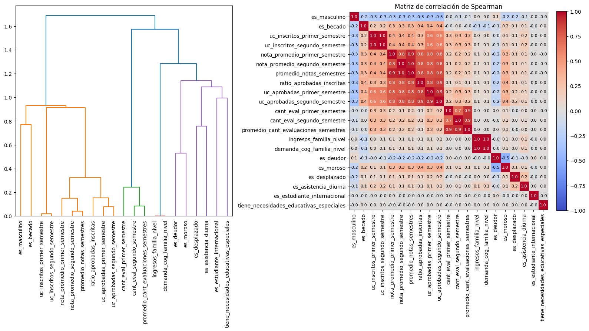

**Trabajo Práctico 1 - Aprendizaje Automático**  
**Estudiante:** Diego Rojas  
**Tema:** Determinantes de la deserción universitaria y predicción

## Resumen

> **Completar al finalizar el análisis.** Presentar en un máximo de 200 palabras: el problema estudiado, los datos utilizados, los modelos comparados, el resultado principal y la conclusión más importante. No incluir información que no se desarrolle posteriormente en el informe.

## Introducción

Este trabajo analiza los determinantes más importantes de la deserción universitaria y desarrolla un modelo predictivo para estimar el riesgo de abandono de los estudiantes al finalizar su primer año. Identificar este riesgo y las variables de mayor impacto resulta fundamental para que áreas como Bienestar Estudiantil o Secretaría Académica puedan realizar intervenciones directas e informadas.

La literatura teórica (Tinto, 1975, 1993; Bean, 1980) y empírica (Yorke y Longden, 2004; OECD, 2019) muestra que la deserción es un fenómeno multicausal, determinado por la interacción de factores individuales, institucionales, socioeconómicos y de integración académica. Debido a que la relevancia de estas variables varía según el contexto, este estudio busca evaluar qué factores resultan más informativos en el conjunto de datos analizado.

Para responder a la pregunta central **¿qué variables permiten explicar y predecir mejor la deserción universitaria después del primer año?**, se realizará un análisis exploratorio y se estructurará la modelado en dos etapas: una clasificación multiclase (graduados, desertores y en curso) donde básicamente estamos interesados en comprender la categoría en curso, y una binaria (graduados vs. desertores). Evaluando los modelos mediante el *F1-score*, se espera confirmar que el desempeño académico inicial, la situación financiera (deuda y becas), la edad y la modalidad de ingreso se posicionen entre los predictores más determinantes.

## Materiales y métodos

Usamos la totalidad del dataset universitario (50k lineas). Las variables fueron renombradas usando la metedologia de *lower_snake_case*. Además, muchas variables catégoricas fueron transformadas a booleanas para facilitar su análsis y posterior uso en los algoritmos. Tambien, se crearon nuevas variables númericas realizando promedios o ratios con las variables existentes.

### i) Datos y variables explicativas (E)

El dataset original contiene 50 mil líneas y 27 variables. Al analizar tanto las variables númericas como categóricas podemos apreciar de que no existen valores nulos en el dataset. Otro punto importante es que para las variables númericas que representan la edad, puntajes, unidades créditicias, etc. no presentan valores negativos, lo cual esta asociado con la lógica esperada. En la tabla 1 y 2 se puede ver con más detalle los principales descriptivos de las principales variables que vamos a usar más adelante.

Tabla 1. *Resumen descriptivo de las variables númericas del dataset ($N = 50.000$)*

| Variable | $N$ | Miss | Missing (%) | Zeros | Positivos | Negativos | Min | Max | Mean | $p_{0.01}$ | $p_{0.05}$ | $p_{0.25}$ | $p_{0.50}$ | $p_{0.75}$ | $p_{0.95}$ | $p_{0.99}$ | Std | Coeff of Variation |
| :--- | :---: | :---: | :---: | :---: | :---: | :---: | :---: | :---: | :---: | :---: | :---: | :---: | :---: | :---: | :---: | :---: | :---: | :---: |
| **cualificacion_promedio** | 50.000 | 0 | 0,00 % | 0 | 50.000 | 0 | 48,00 | 95,00 | 66,26 | 51,99 | 58,00 | 62,00 | 67,00 | 70,00 | 75,00 | 80,00 | 5,52 | 0,08 |
| **puntaje_ingreso** | 50.000 | 0 | 0,00 % | 0 | 50.000 | 0 | 48,00 | 95,00 | 62,67 | 49,00 | 52,00 | 59,00 | 62,00 | 66,00 | 75,00 | 80,00 | 6,28 | 0,10 |
| **edad_inscripcion** | 50.000 | 0 | 0,00 % | 0 | 50.000 | 0 | 17,00 | 70,00 | 22,28 | 18,00 | 18,00 | 18,00 | 19,00 | 23,00 | 38,00 | 49,00 | 6,90 | 0,31 |
| **es_masculino** | 50.000 | 0 | 0,00 % | 34.240 | 15.760 | 0 | 0,00 | 1,00 | 0,32 | 0,00 | 0,00 | 0,00 | 0,00 | 1,00 | 1,00 | 1,00 | 0,46 | 1,47 |
| **es_desplazado** | 50.000 | 0 | 0,00 % | 21.452 | 28.548 | 0 | 0,00 | 1,00 | 0,57 | 0,00 | 0,00 | 0,00 | 1,00 | 1,00 | 1,00 | 1,00 | 0,49 | 0,87 |
| **es_asistencia_diurna** | 50.000 | 0 | 0,00 % | 4.244 | 45.756 | 0 | 0,00 | 1,00 | 0,92 | 0,00 | 0,00 | 1,00 | 1,00 | 1,00 | 1,00 | 1,00 | 0,28 | 0,30 |
| **es_deudor** | 50.000 | 0 | 0,00 % | 46.424 | 3.576 | 0 | 0,00 | 1,00 | 0,07 | 0,00 | 0,00 | 0,00 | 0,00 | 0,00 | 1,00 | 1,00 | 0,26 | 3,60 |
| **es_moroso** | 50.000 | 0 | 0,00 % | 5.361 | 44.639 | 0 | 0,00 | 1,00 | 0,89 | 0,00 | 0,00 | 1,00 | 1,00 | 1,00 | 1,00 | 1,00 | 0,31 | 0,35 |
| **es_becado** | 50.000 | 0 | 0,00 % | 37.622 | 12.378 | 0 | 0,00 | 1,00 | 0,25 | 0,00 | 0,00 | 0,00 | 0,00 | 0,00 | 1,00 | 1,00 | 0,43 | 1,74 |
| **es_estudiante_internacional** | 50.000 | 0 | 0,00 % | 49.671 | 329 | 0 | 0,00 | 1,00 | 0,01 | 0,00 | 0,00 | 0,00 | 0,00 | 0,00 | 0,00 | 0,00 | 0,08 | 12,29 |
| **tiene_necesidades_educativas_especiales** | 50.000 | 0 | 0,00 % | 49.808 | 192 | 0 | 0,00 | 1,00 | 0,00 | 0,00 | 0,00 | 0,00 | 0,00 | 0,00 | 0,00 | 0,00 | 0,06 | 16,11 |
| **promedio_notas_semestres** | 50.000 | 0 | 0,00 % | 10.124 | 39.876 | 0 | 0,00 | 91,00 | 49,12 | 0,00 | 0,00 | 51,00 | 60,50 | 66,00 | 72,50 | 76,00 | 26,22 | 0,53 |
| **promedio_uc_inscritos_semestres** | 50.000 | 0 | 0,00 % | 1.744 | 48.256 | 0 | 0,00 | 21,00 | 5,92 | 0,00 | 5,00 | 5,00 | 6,00 | 6,00 | 8,00 | 11,50 | 1,64 | 0,28 |
| **promedio_uc_aprobadas_semestres** | 50.000 | 0 | 0,00 % | 10.127 | 39.873 | 0 | 0,00 | 20,00 | 4,10 | 0,00 | 0,00 | 1,50 | 5,00 | 6,00 | 7,50 | 10,00 | 2,68 | 0,65 |
| **promedio_cant_evaluaciones_semestres** | 50.000 | 0 | 0,00 % | 5.065 | 44.935 | 0 | 0,00 | 33,00 | 7,32 | 0,00 | 0,00 | 6,00 | 7,50 | 9,00 | 12,50 | 15,50 | 3,32 | 0,45 |
| **ratio_aprobadas_inscritas** | 50.000 | 0 | 0,00 % | 10.131 | 39.869 | 0 | 0,00 | 1,80 | 0,65 | 0,00 | 0,00 | 0,30 | 0,83 | 1,00 | 1,00 | 1,00 | 0,39 | 0,60 |
| **ingresos_familia_nivel** | 50.000 | 0 | 0,00 % | 0 | 50.000 | 0 | 1,00 | 5,00 | 2,24 | 1,00 | 1,00 | 1,00 | 2,00 | 3,00 | 4,50 | 5,00 | 1,12 | 0,50 |
| **demanda_cog_familia_nivel** | 50.000 | 0 | 0,00 % | 0 | 50.000 | 0 | 1,00 | 5,00 | 2,24 | 1,00 | 1,00 | 1,00 | 2,00 | 3,00 | 4,50 | 5,00 | 1,12 | 0,50 |

<small>Resumen de estadísticos descriptivos, distribuciones de percentiles y proporciones de valores nulos/ceros para la cohorte analizada. $N$ = Tamaño de la muestra (número total de registros); Miss = Cantidad de datos faltantes; Missing (%) = Porcentaje de datos faltantes; Zeros = Cantidad de valores iguales a cero; Positivos / Negativos = Frecuencia de valores estrictamente mayores o menores a cero; Min / Max = Valor mínimo y máximo observado; Mean = Media aritmética; $p_{0.01}, p_{0.05}, \dots, p_{0.99}$ = Percentiles específicos del 1 %, 5 %, 25 % (primer cuartil), 50 % (mediana), 75 % (tercer cuartil), 95 % y 99 %; Std = Desviación estándar; Coeff of Variation = Coeficiente de variación (Std / Mean); uc = Unidades curriculares.</small>

Tabla 2. *Resumen descriptivo de las variables categóricas del modelo ($N = 50.000$)*

| Variable | Missing | Niveles | Moda | Frec_Moda | Largo |
| :--- | :---: | :---: | :--- | :---: | :---: |
| **Estudios_máximos_antes_de_la_inscripción** | 0 | 5 | Educación Secundaria | 43.950 | 50.000 |
| **estado_civil** | 0 | 6 | Soltero | 45.861 | 50.000 |
| **modo_aplicacion** | 0 | 4 | Acceso General | 34.694 | 50.000 |
| **macro_categoria_carrera** | 0 | 6 | Comunicación, marketing y diseño | 12.490 | 50.000 |

<small>Resumen de propiedades para las variables cualitativas y categóricas del conjunto de datos. Variable = Nombre del atributo analizado; Missing = Cantidad de datos faltantes; Niveles = Número de categorías únicas o distintas de la variable; Moda = Categoría con mayor frecuencia de aparición; Frec_Moda = Frecuencia absoluta (número de casos) correspondientes a la moda; Largo = Total de registros evaluados ($N$).</small>

### ii) Variable respuesta y tarea objetivo (T)

La variable respuesta es `target`, con tres estados: **Graduado**, **Desertor** y **En curso**. Para la tarea multiclase se conservarán las tres categorías. Para la tarea binaria se excluirá temporalmente la categoría **En curso** y se clasificarán únicamente los casos **Graduado** y **Desertor**, de acuerdo con el objetivo de estimar el riesgo de deserción una vez finalizado el primer año.

Las etiquetas fueron tipificadas de la siguiente manera:
  - Graduado igual a 0
  - Desertor igual a 1
  - En Curso igual a 2

La tabla 3 muestra la distribución de la variable objetivo. Podemos notar que no hay un desbalanceo llamativo en ninguna categoría y que la tasa de graduados es casi del 50%.

Tabla 3. *Distribución de frecuencias de la variable objetivo (target) ($N = 50.000$)*

| Variable | Frecuencia | Frecuencia relativa (%) |
| :--- | :---: | :---: |
| **Graduado** | 23.707 | 47,41 % |
| **Desertor** | 16.529 | 33,06 % |
| **En Curso** | 9.764 | 19,53 % |

<small>Distribución de categorías de la variable dependiente u objetivo (target) del estudio. Variable = Estado académico final del estudiante; Frecuencia = Número absoluto de estudiantes en cada categoría; Frecuencia relativa (%) = Porcentaje respecto al total de la muestra analizada ($N = 50.000$).</small>

### iii) Manejo de datos y esquemas de clasificación

#### Análisis exploratorio de los datos

Antes de hacer el entrenamiento de los modelos vamos a incluir un análisis exploratorio que hicimos en el conjunto de datos.

El en Gráfico 1 podemos ver que todas las variables que involucran unidades curriculares (inscritas y aprobadas) y notas estan bastante correlacionadas entre ellas, con coeficientes entre 0.8 y 0.9. Por otra parte, las variables que indican si un estudiante es moroso o presenta deuda tambien presentan una relación no tan fuerte (-0.5). Cuando creemos más adelante el modelo explicativo es importante excluir aquellas variables que esten correlacionadas para evitar sesgar el feature importance. Podemos apreciar que generalmente la mediana y la apertura de las cajas en mucho mas parecida en las categorías "En Curso" y "Graduado" en comparación a la categoría "Desertor". Es muy probable que cuando entrenemos el modelo multiclase le cueste separar estas dos categorías parecidas. 

En la Tabla 4 tenemos el Informatio Value (IV) de las variables númericas y categoricas usando la variable target. Esta métrica mide la capacidad explicativa de una variable independiente para separar o predecir una clase binaria ("Graduado"/"Desertado"). Permite cuantificar la fuerza predictiva de cada variable y seleccionar las mejores características antes de entrenar un modelo. El top cinco de las varibales con más "poder" predictivo son: i) el ratio de materias aprobadas e inscritas, ii) el promedio de las notas en el primer y segundo semestre, iii) el promedio de la cantidad de evaluaciones en el primer y segundo semestre, iv) si es moroso y v) si es becado.

Tabla 4. *Valor de Información (IV) por variable predictora*

| Variable | Tipo | IV |
| :--- | :---: | :---: |
| **ratio_aprobadas_inscritas** | numerical | 5,38 |
| **promedio_notas_semestres** | numerical | 4,33 |
| **promedio_cant_evaluaciones_semestres** | numerical | 1,65 |
| **es_moroso** | categorical | 1,42 |
| **es_becado** | categorical | 0,97 |
| **edad_inscripcion** | numerical | 0,89 |
| **carrera** | categorical | 0,85 |
| **modo_aplicacion** | categorical | 0,63 |
| **sexo** | categorical | 0,57 |
| **tiene_deuda** | categorical | 0,34 |

<small>Valor de Información (Information Value - IV) para cada variable candidata del modelo. Variable = Nombre del atributo analizado; Tipo = Naturaleza de la variable (numerical = numérica, categorical = categórica); IV = Métrica de poder predictivo (valores IV > 0.3 indican un poder predictivo fuerte, e IV > 0.5 un poder predictivo muy fuerte).</small>

#### Separación del dataset

Para ambos modelos se separa el dataset en train y test (80/20) estratificando por la variable obtivo. Además, se utilizará exclusivamente el **F1-score** para evaluar y comparar los modelos, tanto en la tarea binaria como en la multiclase. Esta decisión se fundamenta en que esta métrica es mucho mas robusta cuando hay presencia de desbalance.

#### Clasificación multiclase

A continuación, entrenamos el modelo multiclase para diferentes hiperparámetros para cada modelo señalados en la Tabla 5. Se usó validación cruzada con 5 splits. Para los modelos de regresión logística se uso la estrategia de one-vs-one y one-vs-rest. Podemos ver que el modelo con mejor performance es AdaBoost, obteniendo un f1-score de 0.78.

Tabla 5. *Resultados del ajuste de hiperparámetros y evaluación de modelos de clasificación*

| Modelo | Estrategia multiclase | Hiperparámetros y rangos evaluados | Valores finales | F1-score |
| :--- | :--- | :--- | :--- | :---: |
| **Regresión Logística (One-vs-Rest)** | One-vs-Rest (OvR) | `penalty`: ["l1", "l2", "elasticnet"] `C`: [0.001, 0.01, 0.1, 1, 10, 100] `l1_ratio`: [0.1, 0.5, 0.9] *(para elasticnet)* | **Completar** | 0,761329 |
| **Regresión Logística (One-vs-One)** | One-vs-One (OvO) | `penalty`: ["l1", "l2", "elasticnet"] `C`: [0.001, 0.01, 0.1, 1, 10, 100] `l1_ratio`: [0.1, 0.5, 0.9] *(para elasticnet)* | **Completar** | 0,772528 |
| **SVM** *(SVC)* | One-vs-One (OvO nativo) | `C`: [0.1, 1, 10, 100] | **Completar** | 0,773364 |
| **K-NN** | Directa (Multiclase nativa) | `n_neighbors`: [3, 5, 7, 9, 11, 13, 15] | **Completar** | 0,731838 |
| **Bagging / Random Forest** | Directa (Multiclase nativa) | `n_estimators`: [100, 200, 400] `max_depth`: [None, 5, 10, 20] `min_samples_split`: [2, 5, 10] `min_samples_leaf`: [1, 2, 4] `max_features`: ["sqrt", "log2"] | **Completar** | 0,776809 |
| **Árbol de decisión** | Directa (Multiclase nativa) | `criterion`: ["gini", "entropy"] `max_depth`: [None, 3, 5, 10, 20] `min_samples_split`: [2, 5, 10] `min_samples_leaf`: [1, 2, 4] | **Completar** | 0,768979 |
| **Boosting** *(AdaBoost)* | Directa (Multiclase nativa) | `n_estimators`: [100, 200] `learning_rate`: [0.01, 0.1, 0.2] `max_depth`: [2, 3, 5] `subsample`: [0.8, 1.0] | **Completar** | 0,782822 |

<small>Resumen de configuraciones, estrategias multiclase e hiperparámetros optimizados mediante búsqueda en rejilla (GridSearchCV) con validación cruzada estratificada de 5 pliegues (StratifiedKFold, 5 splits). SVM = Support Vector Machine; K-NN = K-Nearest Neighbors; OvR = One-vs-Rest; OvO = One-vs-One; F1-score = Métrica de evaluación macro (f1_macro) obtenida en el conjunto de prueba.</small>

Si hacemos una Matriz de Confusión (Tabla 6) del mejor modelo Gradient Boosting, vemos que para los casos reales de la categoría "En Curso", el modelo predice el 60% de los casos de manera correcta, pero casi el 30% de los casos los predice como "Graduados", lo cual nos indica que el modelo le cuesta separar estas categorías y pudieramos decir que en al menos este dataset pudieramos considerarlos como un mismo grupo, ya que como vimos tambien en los boxplot las distribuciones en las variables númericas son muy similares.

Tabla 6. *Matriz de confusión del mejor modelo seleccionado (Gradient Boosting)*

| | Predicho: Clase 0 | Predicho: Clase 1 | Predicho: Clase 2 | Total Real |
| :--- | :---: | :---: | :---: | :---: |
| **Real: Clase 0** | **4.356** | 62 | 323 | 4.741 |
| **Real: Clase 1** | 241 | **2.698** | 367 | 3.306 |
| **Real: Clase 2** | 562 | 228 | **1.163** | 1.953 |
| **Total Predicho** | 5.159 | 2.988 | 1.853 | 10.000 |

<small>Matriz de confusión correspondiente al modelo con mejor rendimiento global (Gradient Boosting) evaluado en el conjunto de prueba ($N = 10.000$). Los valores en la diagonal principal (en negrita) representan las clasificaciones correctas (Verdaderos Positivos por clase), mientras que las celdas fuera de la diagonal corresponden a las desviaciones o errores de clasificación entre las categorías predichas y reales.</small>

#### Clasificación binaria

A continuación, entrenamos un modelo binaria para diferentes hiperparámetros para cada modelo señalados en la Tabla 7, usando la mayoría de las variables númericas y categoricas. Al igual que en el caso anterior se usó validación cruzada con 5 splits. Podemos ver que el modelo con mejor performance fue Gradient Boosting obteniendo un f1-score de 0.940367. Pudieramos usar este modelo para hacer predicciones y el modelo de regresión logística para entender o tener mejor interpretabilidad del modelo.

Tabla 7. *Resumen de optimización de hiperparámetros y F1-score por modelo de clasificación*

| Modelo | Hiperparámetros y rangos evaluados | Valores finales | F1-score |
| :--- | :--- | :--- | :---: |
| **Logistic Regression** | `penalty`: ["l1", "l2", "elasticnet"] `C`: [0.001, 0.01, 0.1, 1, 10, 100] `l1_ratio`: [0.1, 0.5, 0.9] *(para elasticnet)* | **Completar** | 0.938325 |
| **SVM** | `C`: [0.1, 1, 10, 100] | **Completar** | 0.940253 |
| **KNN** | `n_neighbors`: [3, 5, 7, 9, 11, 13, 15] | **Completar** | 0.914212 |
| **Random Forest** | `n_estimators`: [100, 200, 400] `max_depth`: [None, 5, 10, 20] `min_samples_split`: [2, 5, 10] `min_samples_leaf`: [1, 2, 4] `max_features`: ["sqrt", "log2"] | **Completar** | 0.938120 |
| **Decision Tree** | `max_depth`: [None, 3, 5, 10, 20] `min_samples_split`: [2, 5, 10] `min_samples_leaf`: [1, 2, 4] `criterion`: ["gini", "entropy"] | **Completar** | 0.933779 |
| **Gradient Boosting** | `n_estimators`: [100, 200] `learning_rate`: [0.01, 0.1, 0.2] `max_depth`: [2, 3, 5] `subsample`: [0.8, 1.0] | **Completar** | 0.940367 |

<small>Resumen de hiperparámetros evaluados mediante GridSearchCV con StratifiedKFold (5 splits) y métrica F1-macro obtenida en la evaluación final. SVM = Support Vector Machine; KNN = K-Nearest Neighbors; F1-score = Promedio macro ponderado de la métrica F1-score expresado a dos decimales.</small>

Ahora vamos a entrenar un nuevo modelo logístico binario donde las variables no esten correlacionadas. Observando de nuevo el gráfico de correlación vimos que las variables de uc aprobadas, inscritas y las notas durantes los dos primeros semestres estan bastante correlacionadas, asi que vamos a juntarlas en una sola variable llamada indice_rendimiento_academico donde consideramos el ratio de materias aprobadas vs incritas y las notas promedios luego de normalizar estas variables. Ahora vemos que ya no hay correlación fuerte entre las variables.

Al compara el performance f1-score respecto a la versión anterior con todas la variables podemos notar que es del 0.94%, lo cual no significa una gran diferencia con la versión anterior donde teníamos todas las variables.

## Resultados

### Parámetros de los coeficientes del modelo

En la tabla 8, podemos ver que [COMPLEMENTAR HACIENDO UN BREVE ANALISIS]

Tabla 8. *Resultados de la regresión logística (Logit)*

| Variable | Coeficiente ($\beta$) | Error estándar | Valor z | p-valor | IC 95% Inferior | IC 95% Superior |
| :--- | :---: | :---: | :---: | :---: | :---: | :---: |
| **Intercepto** | 0,178 | 0,371 | 0,480 | 0,631 | -0,550 | 0,906 |
| **Estudios máximos: Educación Secundaria** | -0,190 | 0,134 | -1,422 | 0,155 | -0,453 | 0,072 |
| **Estudios máximos: Otro** | 0,556 | 0,671 | 0,828 | 0,408 | -0,759 | 1,871 |
| **Estudios máximos: Superior - Pregrado** | -0,356 | 0,159 | -2,241 | 0,025 | -0,667 | -0,045 |
| **Estado civil: Otro** | 0,353 | 0,212 | 1,668 | 0,095 | -0,062 | 0,768 |
| **Estado civil: Soltero** | 0,417 | 0,122 | 3,420 | 0,001 | 0,178 | 0,656 |
| **Carrera: Ciencias agropecuarias y veterinarias** | -0,242 | 0,082 | -2,937 | 0,003 | -0,403 | -0,080 |
| **Carrera: Ciencias sociales** | -0,343 | 0,072 | -4,767 | 0,000 | -0,485 | -0,202 |
| **Carrera: Comunicación, marketing y diseño** | -0,586 | 0,071 | -8,298 | 0,000 | -0,725 | -0,448 |
| **Carrera: Ingeniería y tecnología** | 1,383 | 0,179 | 7,708 | 0,000 | 1,032 | 1,735 |
| **Carrera: Salud** | -0,892 | 0,081 | -11,033 | 0,000 | -1,051 | -0,734 |
| **Puntaje de ingreso** | -0,037 | 0,004 | -8,993 | 0,000 | -0,045 | -0,029 |
| **Edad de inscripción** | 0,024 | 0,005 | 4,753 | 0,000 | 0,014 | 0,034 |
| **Tiene necesidades educativas especiales** | 0,812 | 0,316 | 2,571 | 0,010 | 0,193 | 1,431 |
| **Es masculino** | 0,513 | 0,054 | 9,449 | 0,000 | 0,406 | 0,619 |
| **Es moroso** | 3,469 | 0,140 | 24,834 | 0,000 | 3,195 | 3,743 |
| **Es becado** | -1,353 | 0,067 | -20,127 | 0,000 | -1,485 | -1,221 |
| **Es estudiante internacional** | -0,815 | 0,297 | -2,745 | 0,006 | -1,396 | -0,233 |
| **Promedio cantidad evaluaciones semestres** | 0,247 | 0,009 | 28,404 | 0,000 | 0,230 | 0,264 |
| **Ingresos familia nivel** | -0,099 | 0,022 | -4,574 | 0,000 | -0,142 | -0,057 |
| **Índice rendimiento académico** | -3,330 | 0,044 | -75,125 | 0,000 | -3,417 | -3,243 |

<small>Resumen del modelo de Regresión Logística ajustado mediante Estimación de Máxima Verosimilitud (MLE). N = 32.188 observaciones; Grados de libertad del modelo = 20; Pseudo $R^2$ = 0,709; Log-Likelihood = -6351,5; LLR p-valor < 0,001. Coeficiente ($\beta$) = Peso estimado en escala log-odds; IC 95% = Intervalo de confianza al 95% para los coeficientes; p-valor < 0,05 indica significancia estadística.</small>

### Curvas de complejidad e importancia de atributos

En la Figura 3, mostramos la curva de complejidad del modelo de regresión logistica para el hiperparámetro C para un modelo Lasso (L1). Este gráfico compara el f1-score en el dataset de entrenamiento y test para diferentes valores del hiperparámetro. Se puede apreciar que la precisión para ambos dataset se hacen estable alrededor de un f1-score del 0.92 a partir de un valor de C igual a 0.1. Esto tambien nos indica que el modelo no tiene problema de overfitting.

Figura 3. *Curva de complejidad del modelo de Regresión Logística (Lasso)*.

<small>Descripción: desempeño en entrenamiento y prueba en función del hiperparámetro C.</small>

Figura 4. *Evolución de los coeficientes del modelo de Regresión Logística (Lasso)*.

<small>Descripción: Impacto de diferentes grados de regularización del hiperparámetro C.</small>

En la Figura 4, presentamos el gráfico de Permutation Feature Importance. Lo que hace esta técnica es evaluar la importancia de cada variable desordenando (permutando) sus valores de forma aleatoria en el conjunto de prueba y midiendo cuánto cae el rendimiento del modelo. Cuanto mayor sea la caída en la métrica (f1-score), más relevante es esa variable para las predicciones del modelo.

De acuerdo a esta técnica, las variables más importantes son el indice de rendimiento académico, si el estudiante es moroso y la cantidad de evaluaciones promedio en los primeros dos semestres. El impacto en el f1-score es de 0.32, 0.05 y 0.01, respectivamente. Tambien, podemos ver como otras variables como el sexo, la edad, puntaje de ingreso e ingreso familiar tiene un impacto muy bajo en esta métrica.

Figura 4. *Variables más influyentes para la predicción de la Deserción estudiantil*

<small>Descripción: importancia de las variables mediante el método de Permutation Feature Importance. La importancia se interpreta como capacidad predictiva y no como efecto causal..</small>

## Discusión

[COMPLEMENTAR]
Los resultados principales indican que **[completar modelo y F1-score]** fue el modelo con mejor desempeño para **[tarea]**. La variable o grupo de variables más informativo fue **[completar]**, lo que permite responder parcialmente la pregunta planteada en la introducción. La elección se fundamenta en el mayor F1-score, ya que esta métrica exige un equilibrio entre detectar correctamente los casos relevantes y evitar predicciones positivas incorrectas.

La relevancia observada del desempeño académico temprano, la situación económica o administrativa y las características de admisión debe discutirse en relación con los modelos de permanencia de Tinto (1975, 1993), Bean (1980) y Bean y Metzner (1985), así como con la evidencia sintetizada por Yorke y Longden (2004) y OECD (2019). Indicar si los hallazgos coinciden con esa literatura o si aparecen diferencias atribuibles al contexto, la cohorte o la composición de la muestra.

Comparar el desempeño de los modelos y explicar las diferencias en términos de complejidad, supuestos, sensibilidad al desbalance y capacidad de generalización. Discutir las aplicaciones prácticas de un sistema de alerta temprana, aclarando que un puntaje predictivo debería orientar intervenciones de acompañamiento y no utilizarse como criterio automático de exclusión.

Finalmente, señalar las limitaciones: **[completar según el análisis]**. Considerar la naturaleza observacional de los datos, la posible falta de variables institucionales o socioeconómicas, el hecho de que asociación no implica causalidad, la calidad y representatividad de la muestra, y la ausencia de validación externa o temporal si corresponde.

## Conclusión

En base a los resultados obtenidos, **[modelo seleccionado]**, con un F1-score de **[completar]**, permite resolver **[confiable/moderadamente/limitadamente]** la tarea de **[clasificación binaria o multiclase]** a partir de las variables disponibles. Los predictores más informativos fueron **[completar]**. El F1-score fue elegido porque ofrece un criterio equilibrado frente al desbalance de clases y evita seleccionar un modelo que funcione bien sólo para la clase mayoritaria. Estos resultados sugieren que **[implicancia principal]**, aunque su aplicación debe considerar las limitaciones del conjunto de datos y utilizarse como apoyo para intervenciones educativas, no como sustituto del análisis institucional o del acompañamiento individual.

## Bibliografía

Bean, J. P. (1980). Dropouts and turnover: The synthesis and test of a causal model of student attrition. *Research in Higher Education, 12*(2), 155-187.

Bean, J. P., y Metzner, B. S. (1985). A conceptual model of nontraditional undergraduate student attrition. *Review of Educational Research, 55*(4), 485-540.

OECD. (2019). *Education at a Glance 2019: OECD Indicators*. OECD Publishing.

Tinto, V. (1975). Dropout from higher education: A theoretical synthesis of recent research. *Review of Educational Research, 45*(1), 89-125.

Tinto, V. (1993). *Leaving College: Rethinking the Causes and Cures of Student Attrition* (2nd ed.). University of Chicago Press.

Yorke, M., y Longden, B. (2004). *Retention and Student Success in Higher Education*. Society for Research into Higher Education y Open University Press.

