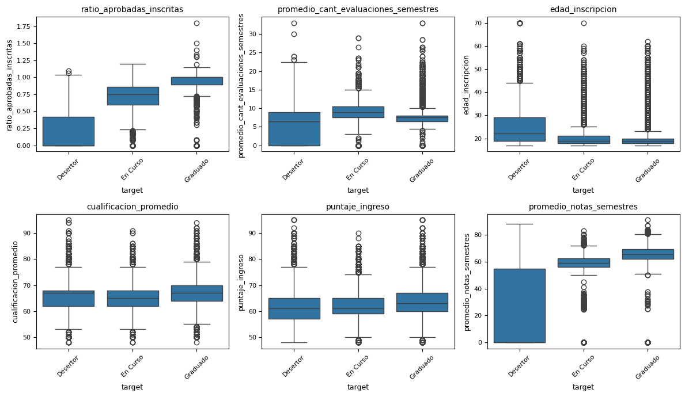
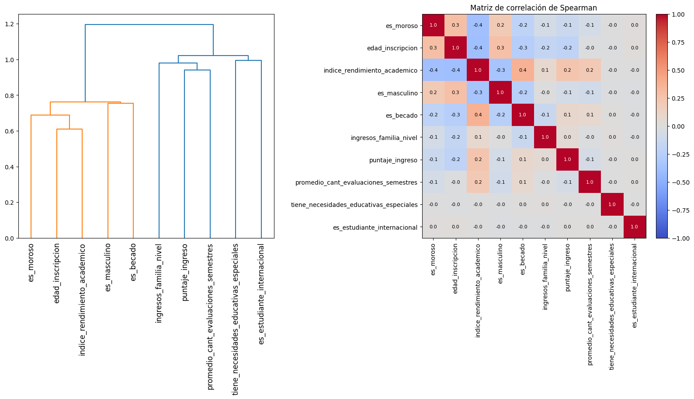
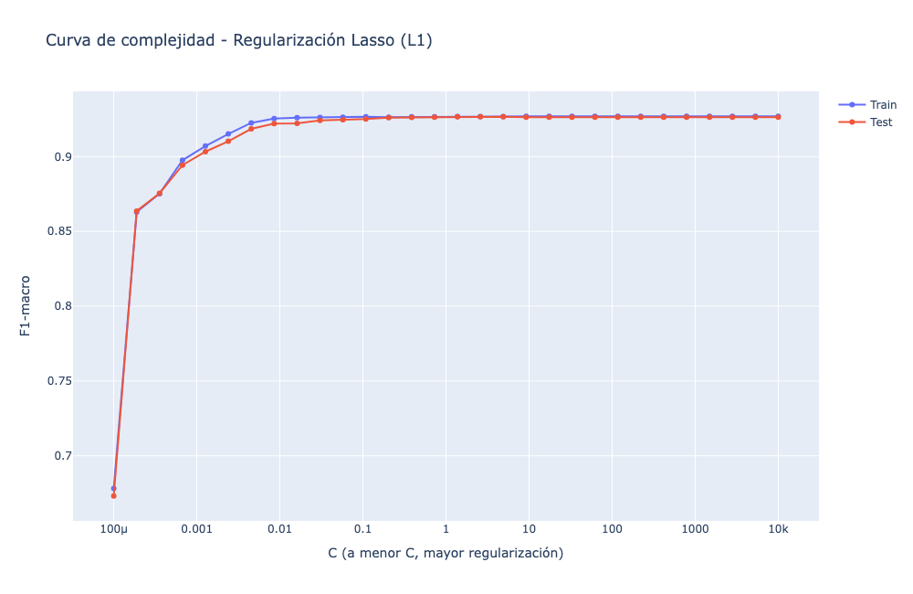
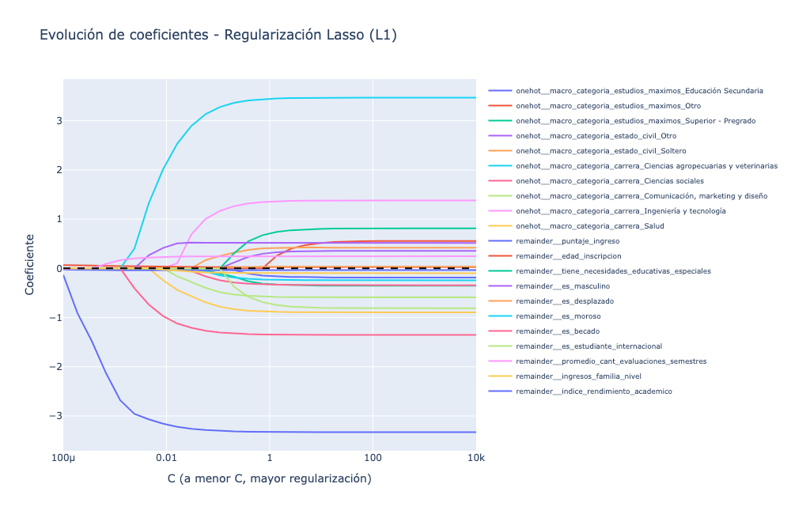
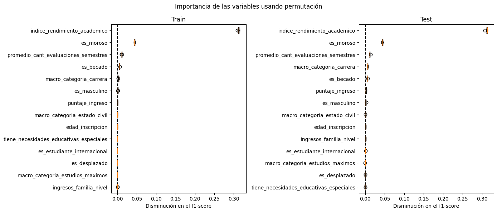

**Trabajo Práctico 1 - Aprendizaje Automático**  
**Estudiante:** Diego Rojas  
**Tema:** Determinantes de la deserción universitaria y predicción

## Resumen

Este trabajo tiene tres objetivos relacionados con la deserción universitaria al cierre del primer año: comprender cómo se distingue la categoría «En curso» mediante una clasificación multiclase; desarrollar un modelo binario que, con información académica y personal del primer año, estime el riesgo de abandono de estudiantes que continúan en curso en cohortes futuras y oriente acciones de las áreas responsables; y analizar los factores asociados a la deserción mediante una regresión logística explicativa. Con datos de 50.000 estudiantes, Gradient Boosting obtuvo un F1-macro de 0,783 en la tarea multiclase y de 0,940 en la tarea binaria. En el modelo logístico reducido, el índice de rendimiento académico y la morosidad fueron los predictores con mayor importancia por permutación. Para entrenar y evaluar la tarea binaria se usaron casos con desenlace conocido (graduados o desertores); la intención es aplicar el modelo a estudiantes «En curso» de cohortes futuras, una vez disponibles sus datos del primer año.

## Introducción

Este trabajo aborda la deserción universitaria al finalizar el primer año con tres objetivos complementarios. Primero, comprender la categoría «En curso» y sus diferencias con «Graduado» y «Desertor» mediante una clasificación multiclase. Segundo, construir un modelo binario que estime el riesgo de abandono para que las áreas responsables puedan utilizarlo como insumo al planificar acciones de acompañamiento para los estudiantes que finalizan el primer año. Tercero, analizar mediante regresión logística qué factores se asocian con la deserción, con el propósito de facilitar la interpretación de sus determinantes. Una estimación de riesgo puede apoyar la identificación de necesidades, pero no debe utilizarse como decisión automática sobre la trayectoria individual.

La literatura teórica (Tinto, 1975, 1993; Bean, 1980; Bean y Metzner, 1985) y empírica (Yorke y Longden, 2004; OECD, 2019) caracteriza la deserción como un fenómeno multicausal, relacionado con factores individuales, institucionales, socioeconómicos y de integración académica. Como la relevancia de estos factores puede variar según el contexto, este estudio evalúa cuáles resultan más informativos en el conjunto de datos analizado.

La pregunta que guía el estudio es **¿cómo permiten las variables disponibles al finalizar el primer año comprender la categoría «En curso», estimar el riesgo de deserción y analizar los factores asociados con el abandono?** Se plantea que el desempeño académico, la situación financiera, la edad y algunas características de ingreso aportan información para esos propósitos. Para abordarlos, se comparan clasificadores multiclase y binarios y se ajusta un modelo logístico con un conjunto reducido de predictores. La tarea binaria se entrena con estudiantes cuyo desenlace se conoce (graduados o desertores) y se propone aplicar el modelo a estudiantes que continúan «En curso» en cohortes futuras, utilizando sus variables observadas durante el primer año. El informe presenta los datos y métodos, los resultados de cada objetivo y sus implicancias y limitaciones.

## Materiales y métodos

Se utilizó el conjunto de datos universitario provisto para el trabajo práctico, con 50.000 registros y 27 variables originales. Los nombres de las variables se normalizaron con el formato *lower_snake_case*. Las variables categóricas con respuestas «Sí» y «No» se recodificaron como indicadores binarios (1 y 0). Además, se construyeron variables numéricas derivadas, como promedios de los dos primeros semestres y razones entre variables existentes. El diccionario de datos, que describe las variables y sus valores, puede consultarse [aquí](../dataset/diccionario_datos_TP1_2026.xlsx).

Para este estudio se asume que las variables explicativas corresponden a información recopilada al finalizar el primer año y disponible en ese momento para realizar la predicción, mientras que la variable objetivo representa el desenlace académico posterior. Bajo este supuesto, no habría *data leakage* temporal: los predictores estarían disponibles antes del desenlace que se busca anticipar.

### i) Datos y variables explicativas (E)

No se detectaron valores faltantes en las variables analizadas, y las variables numéricas de edad, puntajes y unidades curriculares no presentan valores negativos. La Tabla 1 resume los estadísticos descriptivos de las principales variables numéricas, mientras que la Tabla 2 informa el número de categorías y la moda de las variables categóricas seleccionadas. Se observa que, en algunos registros, la cantidad de unidades curriculares aprobadas supera la cantidad de unidades inscritas. Esto explica que `ratio_aprobadas_inscritas` alcance valores superiores a 1; su máximo es 1,80 (Tabla 1).

Tabla 1. *Resumen descriptivo de las variables numéricas del conjunto de datos ($N = 50.000$)*

| Variable | $N$ | Faltantes | Ceros | Positivos | Negativos | Mín. | Máx. | Media | $p_{0.50}$ | DE | CV |
| :--- | :---: | :---: | :---: | :---: | :---: | :---: | :---: | :---: | :---: | :---: | :---: |
| **cualificacion_promedio** | 50.000 | 0 | 0 | 50.000 | 0 | 48,00 | 95,00 | 66,26 | 67,00 | 5,52 | 0,08 |
| **puntaje_ingreso** | 50.000 | 0 | 0 | 50.000 | 0 | 48,00 | 95,00 | 62,67 | 62,00 | 6,28 | 0,10 |
| **edad_inscripcion** | 50.000 | 0 | 0 | 50.000 | 0 | 17,00 | 70,00 | 22,28 | 19,00 | 6,90 | 0,31 |
| **es_masculino** | 50.000 | 0 | 34.240 | 15.760 | 0 | 0,00 | 1,00 | 0,32 | 0,00 | 0,46 | 1,47 |
| **es_desplazado** | 50.000 | 0 | 21.452 | 28.548 | 0 | 0,00 | 1,00 | 0,57 | 1,00 | 0,49 | 0,87 |
| **es_asistencia_diurna** | 50.000 | 0 | 4.244 | 45.756 | 0 | 0,00 | 1,00 | 0,92 | 1,00 | 0,28 | 0,30 |
| **es_deudor** | 50.000 | 0 | 46.424 | 3.576 | 0 | 0,00 | 1,00 | 0,07 | 0,00 | 0,26 | 3,60 |
| **es_moroso** | 50.000 | 0 | 5.361 | 44.639 | 0 | 0,00 | 1,00 | 0,89 | 1,00 | 0,31 | 0,35 |
| **es_becado** | 50.000 | 0 | 37.622 | 12.378 | 0 | 0,00 | 1,00 | 0,25 | 0,00 | 0,43 | 1,74 |
| **es_estudiante_internacional** | 50.000 | 0 | 49.671 | 329 | 0 | 0,00 | 1,00 | 0,01 | 0,00 | 0,08 | 12,29 |
| **tiene_necesidades_educativas_especiales** | 50.000 | 0 | 49.808 | 192 | 0 | 0,00 | 1,00 | 0,00 | 0,00 | 0,06 | 16,11 |
| **promedio_notas_semestres** | 50.000 | 0 | 10.124 | 39.876 | 0 | 0,00 | 91,00 | 49,12 | 60,50 | 26,22 | 0,53 |
| **promedio_uc_inscritos_semestres** | 50.000 | 0 | 1.744 | 48.256 | 0 | 0,00 | 21,00 | 5,92 | 6,00 | 1,64 | 0,28 |
| **promedio_uc_aprobadas_semestres** | 50.000 | 0 | 10.127 | 39.873 | 0 | 0,00 | 20,00 | 4,10 | 5,00 | 2,68 | 0,65 |
| **promedio_cant_evaluaciones_semestres** | 50.000 | 0 | 5.065 | 44.935 | 0 | 0,00 | 33,00 | 7,32 | 7,50 | 3,32 | 0,45 |
| **ratio_aprobadas_inscritas** | 50.000 | 0 | 10.131 | 39.869 | 0 | 0,00 | 1,80 | 0,65 | 0,83 | 0,39 | 0,60 |
| **ingresos_familia_nivel** | 50.000 | 0 | 0 | 50.000 | 0 | 1,00 | 5,00 | 2,24 | 2,00 | 1,12 | 0,50 |
| **demanda_cog_familia_nivel** | 50.000 | 0 | 0 | 50.000 | 0 | 1,00 | 5,00 | 2,24 | 2,00 | 1,12 | 0,50 |

<small>Estadísticos descriptivos de las variables numéricas y frecuencias de valores faltantes y ceros. $N$ = número de registros; Positivos/Negativos = valores mayores/menores que cero; $p_{0.50}$ = mediana; DE = desviación estándar; CV = coeficiente de variación (DE / media); uc = unidades curriculares. En las variables binarias, los ceros y positivos indican las frecuencias de las categorías 0 y 1, respectivamente.</small>

Tabla 2. *Resumen descriptivo de las variables categóricas del modelo ($N = 50.000$)*

| Variable | Faltantes | Niveles | Moda | Frecuencia de la moda | Registros |
| :--- | :---: | :---: | :--- | :---: | :---: |
| **Estudios_máximos_antes_de_la_inscripción** | 0 | 5 | Educación Secundaria | 43.950 | 50.000 |
| **estado_civil** | 0 | 6 | Soltero | 45.861 | 50.000 |
| **modo_aplicacion** | 0 | 4 | Acceso General | 34.694 | 50.000 |
| **macro_categoria_carrera** | 0 | 6 | Comunicación, marketing y diseño | 12.490 | 50.000 |

<small>Propiedades de las variables categóricas. Niveles = cantidad de categorías distintas; Moda = categoría más frecuente; Frecuencia de la moda = número de registros en esa categoría; Registros = total de observaciones analizadas.</small>

### ii) Variable respuesta y tarea objetivo (T)

La variable objetivo `target` identifica tres estados académicos: **Graduado**, **Desertor** y **En curso**. Para la clasificación multiclase se conservaron los tres estados y se codificaron como 0, 1 y 2, respectivamente. En la tarea binaria se utilizaron únicamente los casos con desenlace conocido —graduados (0) y desertores (1)—; se excluyeron los estudiantes en curso. El propósito es aplicar el modelo a estudiantes que continúan en curso en cohortes futuras, utilizando sus datos del primer año para estimar el riesgo de abandono.

Como muestra la Tabla 3, los graduados representan el 47,41 % del conjunto, los desertores el 33,06 % y los estudiantes en curso el 19,53 %. Dado que las clases no tienen la misma frecuencia, se estratificaron las particiones y se utilizó F1-macro, que otorga el mismo peso a cada clase.

Tabla 3. *Distribución de frecuencias de la variable objetivo (target) ($N = 50.000$)*

| Variable | Frecuencia | Frecuencia relativa (%) |
| :--- | :---: | :---: |
| **Graduado** | 23.707 | 47,41 % |
| **Desertor** | 16.529 | 33,06 % |
| **En Curso** | 9.764 | 19,53 % |

<small>Distribución de categorías de la variable dependiente u objetivo (target) del estudio. Variable = Estado académico final del estudiante; Frecuencia = Número absoluto de estudiantes en cada categoría; Frecuencia relativa (%) = Porcentaje respecto al total de la muestra analizada ($N = 50.000$).</small>

### iii) Manejo de datos y esquemas de clasificación

#### Análisis exploratorio de los datos

El análisis exploratorio se realizó antes del ajuste de los modelos. La Figura 1 presenta el agrupamiento jerárquico y la matriz de correlación de Spearman de las variables numéricas. Se observan asociaciones altas entre las unidades curriculares inscritas y aprobadas y las notas de ambos semestres; en varios pares, los coeficientes se sitúan aproximadamente entre 0,8 y 1,0. También se observa una correlación negativa cercana a -0,5 entre los indicadores de deuda y morosidad. Estas relaciones sugieren redundancia entre algunos predictores. Por este motivo, en el modelo logístico explicativo se redujo el conjunto de variables académicas y se construyó un índice compuesto.

Figura 1. *Agrupamiento jerárquico y matriz de correlación de Spearman de las variables numéricas.* Los valores de la matriz representan correlaciones por rangos; el agrupamiento muestra qué variables presentan patrones de asociación similares.

La Figura 2 compara las distribuciones de seis variables numéricas según el estado académico. El promedio de notas y la razón de unidades aprobadas sobre inscritas muestran diferencias más marcadas entre desertores y graduados. En cambio, algunas distribuciones de graduados y estudiantes en curso se superponen, aunque esto no implica que ambos estados sean equivalentes. Esta superposición ayuda a contextualizar la dificultad del modelo multiclase para identificar correctamente la categoría en curso, como se verá en la Tabla 6.

Figura 2. *Distribución de variables numéricas según la categoría de `target`.* Las líneas centrales representan las medianas, las cajas el rango intercuartílico y los puntos las observaciones atípicas.

La Tabla 4 presenta las diez variables con los valores más altos de Valor de Información (IV), una métrica que resume cuánto contribuye cada predictor a separar las categorías de una variable objetivo. Se utilizó la formulación habitual del IV para una respuesta binaria; por ello, el cálculo compara **Graduado** con **Desertor** y excluye los casos **En curso**. El ranking se calculó sobre el conjunto binario completo antes de la partición en entrenamiento y prueba y se utilizó únicamente como análisis exploratorio para identificar qué variables podían tener mayor capacidad predictiva. No se empleó para seleccionar variables ni ajustar los modelos; por ello, no se presenta como una evaluación independiente de su desempeño.

Como referencia, suelen interpretarse valores de IV inferiores a 0,02 como casi nulos; entre 0,02 y 0,10 como débiles; entre 0,10 y 0,30 como moderados; y entre 0,30 y 0,50 como fuertes. Los valores superiores a 0,50 son inusualmente altos y pueden indicar *data leakage*, por lo que deben revisarse. En el top 10, `ratio_aprobadas_inscritas` (5,38) y `promedio_notas_semestres` (4,33) muestran los valores más altos, seguidos por el promedio de evaluaciones (1,65), la morosidad (1,42) y la condición de becario (0,97). En conjunto, el ranking destaca variables de rendimiento académico y de situación financiera.

Tabla 4. *Top 10 de variables predictoras con mayor Valor de Información (IV)*

| Variable | Tipo | IV |
| :--- | :---: | :---: |
| **ratio_aprobadas_inscritas** | Numérica | 5,38 |
| **promedio_notas_semestres** | Numérica | 4,33 |
| **promedio_cant_evaluaciones_semestres** | Numérica | 1,65 |
| **es_moroso** | Categórica | 1,42 |
| **es_becado** | Categórica | 0,97 |
| **edad_inscripcion** | Numérica | 0,89 |
| **carrera** | Categórica | 0,85 |
| **modo_aplicacion** | Categórica | 0,63 |
| **sexo** | Categórica | 0,57 |
| **tiene_deuda** | Categórica | 0,34 |

<small>Valor de Información (IV) por variable candidata para distinguir graduados de desertores. El IV no es un porcentaje; depende del modo en que se agrupan los valores de cada predictor.</small>

#### Partición del conjunto de datos

Para cada tarea, los datos se dividieron en conjuntos de entrenamiento y prueba en una proporción de 80/20, con `random_state=42` y estratificación según la variable objetivo. Los hiperparámetros se seleccionaron mediante validación cruzada estratificada de cinco pliegues aplicada al conjunto de entrenamiento. El preprocesamiento categórico se incluyó en los *pipelines* para evitar fuga de información entre pliegues. Los modelos se compararon mediante F1-macro: se calcula el F1-score de cada clase —la media armónica entre *precision* y *recall*— y luego se promedian los resultados con el mismo peso. Esta medida es pertinente ante la distribución desigual de las categorías. Para mostrar los errores por clase se presenta también la matriz de confusión multiclase. Los valores de F1-macro de las Tablas 5 y 7 corresponden al conjunto de prueba.

Las variables categóricas se codificaron mediante *one-hot encoding*. Las variables numéricas se conservaron en sus escalas originales, excepto en K-NN, donde se escalaron porque este algoritmo se basa en distancias.

## Resultados

### Clasificación multiclase

La Tabla 5 resume los modelos multiclase, sus estrategias y los hiperparámetros seleccionados. En regresión logística se evaluaron los esquemas *one-vs-rest* (OvR) y *one-vs-one* (OvO); SVM utilizó OvO, mientras que los demás clasificadores admitieron directamente las tres clases. Gradient Boosting obtuvo el F1-macro más alto (0,7828), seguido por Random Forest (0,7768) y SVM (0,7734). La diferencia entre el primer y el tercer modelo es pequeña y debe interpretarse considerando que se evaluó una única partición de prueba.

Tabla 5. *Resultados del ajuste de hiperparámetros y evaluación de modelos de clasificación*

| Modelo | Estrategia multiclase | Hiperparámetros y rangos evaluados | Valores finales | F1-macro |
| :--- | :--- | :--- | :--- | :---: |
| **Regresión Logística (One-vs-Rest)** | One-vs-Rest (OvR) | `penalty`: ["l1", "l2", "elasticnet"] `C`: [0.001, 0.01, 0.1, 1, 10, 100] `l1_ratio`: [0.1, 0.5, 0.9] *(para elasticnet)* | `penalty`: 'elasticnet' `C`: 1 `l1_ratio`: 0.9 | 0,7613 |
| **Regresión Logística (One-vs-One)** | One-vs-One (OvO) | `penalty`: ["l1", "l2", "elasticnet"] `C`: [0.001, 0.01, 0.1, 1, 10, 100] `l1_ratio`: [0.1, 0.5, 0.9] *(para elasticnet)* | `penalty`: 'l1' `C`: 10 | 0,7725 |
| **SVM** *(SVC)* | One-vs-One (OvO nativo) | `C`: [0.1, 1, 10, 100] | `C`: 100 | 0,7734 |
| **K-NN** | Directa (Multiclase nativa) | `n_neighbors`: [3, 5, 7, 9, 11, 13, 15] | `n_neighbors`: 15 | 0,7318 |
| **Bagging / Random Forest** | Directa (Multiclase nativa) | `n_estimators`: [100, 200, 400] `max_depth`: [None, 5, 10, 20] `min_samples_split`: [2, 5, 10] `min_samples_leaf`: [1, 2, 4] `max_features`: ["sqrt", "log2"] | `n_estimators`: 200 `max_depth`: 20 `min_samples_split`: 10 `min_samples_leaf`: 1 `max_features`: 'sqrt' | 0,7768 |
| **Árbol de decisión** | Directa (Multiclase nativa) | `criterion`: ["gini", "entropy"] `max_depth`: [None, 3, 5, 10, 20] `min_samples_split`: [2, 5, 10] `min_samples_leaf`: [1, 2, 4] | `criterion`: 'gini' `max_depth`: 5 `min_samples_leaf`: 4 `min_samples_split`: 2 | 0,7690 |
| **Boosting** *(Gradient Boosting)* | Directa (Multiclase nativa) | `n_estimators`: [100, 200] `learning_rate`: [0.01, 0.1, 0.2] `max_depth`: [2, 3, 5] `subsample`: [0.8, 1.0] | `n_estimators`: 100 `learning_rate`: 0.1 `max_depth`: 5 `subsample`: 0.8 | 0,7828 |

<small>Hiperparámetros seleccionados mediante búsqueda en rejilla (GridSearchCV) y validación cruzada estratificada de cinco pliegues; F1-macro calculado en el conjunto de prueba y redondeado a cuatro decimales. SVM = máquina de soporte vectorial; K-NN = vecinos más cercanos; OvR = uno contra el resto; OvO = uno contra uno.</small>

La Tabla 6 presenta la matriz de confusión del mejor modelo multiclase: las filas corresponden a las clases reales y las columnas, a las predichas. La codificación es 0 = graduado, 1 = desertor y 2 = en curso. El modelo clasificó correctamente el 91,9 % de los graduados (4.356 de 4.741), el 81,6 % de los desertores (2.698 de 3.306) y el 59,5 % de los estudiantes en curso (1.163 de 1.953). Además, asignó a la clase graduado el 28,8 % de los casos que estaban en curso. Esto muestra que «En curso» es la clase más difícil de identificar, pero no justifica combinarla con graduados, ya que representan estados académicos diferentes.

Este patrón es coherente con los diagramas de caja de la Figura 2, donde varias variables numéricas presentan distribuciones similares para «En curso» y «Graduado». Esa superposición puede contribuir a que el modelo confunda ambas clases, aunque no explica por sí sola todos los errores de clasificación.

Tabla 6. *Matriz de confusión del mejor modelo seleccionado (Gradient Boosting)*

| | Predicho: Clase 0 | Predicho: Clase 1 | Predicho: Clase 2 | Total Real |
| :--- | :---: | :---: | :---: | :---: |
| **Real: Clase 0** | **4.356** | 62 | 323 | 4.741 |
| **Real: Clase 1** | 241 | **2.698** | 367 | 3.306 |
| **Real: Clase 2** | 562 | 228 | **1.163** | 1.953 |
| **Total Predicho** | 5.159 | 2.988 | 1.853 | 10.000 |

<small>Matriz de confusión de Gradient Boosting en el conjunto de prueba ($N = 10.000$). Filas = clase real; columnas = clase predicha; la diagonal contiene los aciertos y las restantes celdas, los errores.</small>

### Clasificación binaria

La tarea binaria incluyó 40.236 registros con desenlace conocido: graduados y desertores. La Tabla 7 presenta los F1-macro obtenidos en el conjunto de prueba. Gradient Boosting alcanzó el valor más alto (0,9404), seguido por SVM (0,9403), regresión logística (0,9383) y *Voting (soft)* (0,9394); K-NN obtuvo 0,9142. La diferencia entre Gradient Boosting y SVM es mínima, y el ensamble no superó a los modelos individuales.

Tabla 7. *Resumen de optimización de hiperparámetros y F1-macro por modelo de clasificación*

| Modelo | Hiperparámetros y rangos evaluados | Valores finales | F1-macro |
| :--- | :--- | :--- | :---: |
| **Regresión logística** | `penalty`: ["l1", "l2", "elasticnet"] `C`: [0.001, 0.01, 0.1, 1, 10, 100] `l1_ratio`: [0.1, 0.5, 0.9] *(para elasticnet)* | `penalty`: 'l1' `C`: 1 | 0,9383 |
| **SVM** | `C`: [0.1, 1, 10, 100] | `C`: 100 | 0,9403 |
| **K-NN** | `n_neighbors`: [3, 5, 7, 9, 11, 13, 15] | `n_neighbors`: 13 | 0,9142 |
| **Random Forest** | `n_estimators`: [100, 200, 400] `max_depth`: [None, 5, 10, 20] `min_samples_split`: [2, 5, 10] `min_samples_leaf`: [1, 2, 4] `max_features`: ["sqrt", "log2"] | `n_estimators`: 400 `max_depth`: 20 `min_samples_split`: 5 `min_samples_leaf`: 1 `max_features`: 'sqrt' | 0,9381 |
| **Árbol de decisión** | `max_depth`: [None, 3, 5, 10, 20] `min_samples_split`: [2, 5, 10] `min_samples_leaf`: [1, 2, 4] `criterion`: ["gini", "entropy"] | `max_depth`: 5 `min_samples_leaf`: 2 `min_samples_split`: 2 `criterion`: 'gini' | 0,9338 |
| **Gradient Boosting** | `n_estimators`: [100, 200] `learning_rate`: [0.01, 0.1, 0.2] `max_depth`: [2, 3, 5] `subsample`: [0.8, 1.0] | `n_estimators`: 200 `learning_rate`: 0.1 `max_depth`: 3 `subsample`: 0.8 | 0,9404 |
| **Voting (soft)** | Combinación de regresión logística, SVM y Random Forest | `voting`: 'soft' | 0,9394 |

<small>Hiperparámetros seleccionados mediante GridSearchCV con validación cruzada estratificada de cinco pliegues; F1-macro calculado en el conjunto de prueba y redondeado a cuatro decimales. Voting (soft) combina las probabilidades de regresión logística, SVM y Random Forest; SVM = máquina de soporte vectorial; K-NN = vecinos más cercanos.</small>

Para examinar qué factores se asocian con la deserción, se ajustó una regresión logística con un conjunto reducido de predictores, con el fin de facilitar la interpretación y disminuir la redundancia entre algunas variables académicas. El promedio de notas y la razón entre unidades aprobadas e inscritas se estandarizaron con la media y la desviación estándar del conjunto de entrenamiento. Luego se promediaron para formar `indice_rendimiento_academico` y se retiraron del modelo las dos variables originales. Como muestra la Figura 3, las correlaciones entre los predictores seleccionados son moderadas y menores que las observadas entre varios pares de variables académicas en la Figura 1.

Figura 3. *Agrupamiento jerárquico y matriz de correlación de Spearman de las variables seleccionadas.* El índice de rendimiento combina las variables académicas estandarizadas.

En el conjunto de prueba, este modelo obtuvo un F1-macro cercano a 0,94, similar al del modelo logístico con más variables (Tabla 7). La reducción de predictores mantuvo un desempeño comparable y facilita la interpretación de los coeficientes.

### Modelo logístico explicativo

#### Coeficientes del modelo

La Tabla 8 presenta los coeficientes de la regresión logística estimada con el conjunto de entrenamiento de la tarea binaria. Como la deserción se codificó con 1, un coeficiente positivo se asocia con mayores *log-odds* de deserción y uno negativo, con menores *log-odds*, manteniendo constantes los demás predictores. El índice de rendimiento académico tiene un coeficiente negativo (-3,330), mientras que la morosidad presenta uno positivo (3,469); en ambos casos, los intervalos de confianza no incluyen cero. También se observan asociaciones positivas con el promedio de evaluaciones, la edad y el indicador masculino, y negativas con la condición de becario, el puntaje de ingreso y los ingresos familiares. Los coeficientes de las variables categóricas se interpretan en relación con las categorías de referencia omitidas. En términos generales, este patrón de asociaciones es compatible con la perspectiva multicausal de la literatura citada.

Tabla 8. *Resultados de la regresión logística (Logit)*

| Variable | Coeficiente ($\beta$) | Error estándar | Valor z | p-valor | IC 95% Inferior | IC 95% Superior |
| :--- | :---: | :---: | :---: | :---: | :---: | :---: |
| **Intercepto** | 0,178 | 0,371 | 0,480 | 0,631 | -0,550 | 0,906 |
| **Estudios máximos: Educación Secundaria** | -0,190 | 0,134 | -1,422 | 0,155 | -0,453 | 0,072 |
| **Estudios máximos: Otro** | 0,556 | 0,671 | 0,828 | 0,408 | -0,759 | 1,871 |
| **Estudios máximos: Superior - Pregrado** | -0,356 | 0,159 | -2,241 | 0,025 | -0,667 | -0,045 |
| **Estado civil: Otro** | 0,353 | 0,212 | 1,668 | 0,095 | -0,062 | 0,768 |
| **Estado civil: Soltero** | 0,417 | 0,122 | 3,420 | 0,001 | 0,178 | 0,656 |
| **Carrera: Ciencias agropecuarias y veterinarias** | -0,242 | 0,082 | -2,937 | 0,003 | -0,403 | -0,080 |
| **Carrera: Ciencias sociales** | -0,343 | 0,072 | -4,767 | <0,001 | -0,485 | -0,202 |
| **Carrera: Comunicación, marketing y diseño** | -0,586 | 0,071 | -8,298 | <0,001 | -0,725 | -0,448 |
| **Carrera: Ingeniería y tecnología** | 1,383 | 0,179 | 7,708 | <0,001 | 1,032 | 1,735 |
| **Carrera: Salud** | -0,892 | 0,081 | -11,033 | <0,001 | -1,051 | -0,734 |
| **Puntaje de ingreso** | -0,037 | 0,004 | -8,993 | <0,001 | -0,045 | -0,029 |
| **Edad de inscripción** | 0,024 | 0,005 | 4,753 | <0,001 | 0,014 | 0,034 |
| **Tiene necesidades educativas especiales** | 0,812 | 0,316 | 2,571 | 0,010 | 0,193 | 1,431 |
| **Es masculino** | 0,513 | 0,054 | 9,449 | <0,001 | 0,406 | 0,619 |
| **Es moroso** | 3,469 | 0,140 | 24,834 | <0,001 | 3,195 | 3,743 |
| **Es becado** | -1,353 | 0,067 | -20,127 | <0,001 | -1,485 | -1,221 |
| **Es estudiante internacional** | -0,815 | 0,297 | -2,745 | 0,006 | -1,396 | -0,233 |
| **Promedio cantidad evaluaciones semestres** | 0,247 | 0,009 | 28,404 | <0,001 | 0,230 | 0,264 |
| **Ingresos familia nivel** | -0,099 | 0,022 | -4,574 | <0,001 | -0,142 | -0,057 |
| **Índice rendimiento académico** | -3,330 | 0,044 | -75,125 | <0,001 | -3,417 | -3,243 |

<small>Modelo Logit estimado por máxima verosimilitud con el conjunto de entrenamiento ($N = 32.188$); grados de libertad = 20; pseudo-$R^2$ = 0,709; log-verosimilitud = -6.351,5; prueba de razón de verosimilitud, $p < 0,001$. $\beta$ = coeficiente en escala log-odds; IC 95 % = intervalo de confianza al 95 %. Para las variables categóricas, los coeficientes se comparan con la categoría de referencia omitida durante la codificación.</small>

#### Curva de complejidad y análisis de importancia

La Figura 4 muestra la curva de complejidad de la regresión logística con regularización L1. El eje horizontal representa $C$, inverso de la fuerza de regularización: cuanto menor es $C$, mayor es la penalización. El F1-macro de entrenamiento y prueba aumenta con rapidez para los valores más bajos de $C$ y se estabiliza alrededor de 0,92–0,93 desde aproximadamente $C=0,01$; ambas curvas se mantienen próximas en el rango mostrado. La curva permite observar cómo cambia el desempeño al variar la regularización. Como se evaluaron varios valores de $C$ en el conjunto de prueba, sus resultados deben interpretarse con cautela.

Figura 4. *F1-macro en entrenamiento y prueba para distintos valores de $C$.* Un valor menor de $C$ implica una regularización más intensa.

La Figura 5 muestra qué coeficientes permanecen alejados de cero cuando la regularización es intensa. El coeficiente del índice de rendimiento académico es el más persistente a lo largo del rango de $C$, mientras que los de morosidad y algunas categorías de carrera aumentan al reducirse la penalización. Esto sugiere que el índice aporta una señal predictiva estable en este modelo. Sin embargo, dado que no todos los predictores numéricos están en la misma escala, la persistencia de sus coeficientes debe interpretarse con cautela. El análisis de la trayectoria se complementa con la importancia por permutación de la Figura 6, que muestra cuánto disminuye el F1-macro al permutar cada predictor.

Figura 5. *Trayectoria de los coeficientes para distintos valores de $C$.* La línea horizontal discontinua marca el valor cero.

La Figura 6 presenta la importancia por permutación, calculada como la disminución del F1-macro al permutar los valores de cada predictor. En el conjunto de prueba, el índice de rendimiento académico produce la mayor disminución (aproximadamente 0,31), seguido por la morosidad (cerca de 0,05) y el promedio de evaluaciones (alrededor de 0,01). Las demás variables generan cambios menores. El patrón similar entre entrenamiento y prueba indica que estas variables aportan información a las predicciones de esta regresión logística.

Figura 6. *Disminución del F1-macro tras permutar cada predictor.* Los paneles corresponden a entrenamiento y prueba; una disminución mayor indica una contribución predictiva mayor en este modelo.

## Discusión

Los resultados abordan la deserción desde tres perspectivas relacionadas: reconocer la situación académica, anticipar el abandono y comprender qué variables se asocian con él. En la clasificación multiclase, Gradient Boosting obtuvo el mayor F1-macro (0,7828; Tabla 5), pero la matriz de confusión muestra que identificó correctamente el 59,5 % de los estudiantes «En curso», frente al 91,9 % de graduados y al 81,6 % de desertores (Tabla 6). La superposición de algunas distribuciones en los diagramas de caja (Figura 2) ayuda a comprender esta diferencia. Por ello, el resultado global debe considerarse junto con el desempeño de cada clase: «En curso» es la categoría más difícil de reconocer, aunque representa un estado académico distinto de «Graduado».

El objetivo predictivo binario es distinto: busca anticipar el abandono a partir de la información del primer año. Gradient Boosting obtuvo un F1-macro de 0,9404, prácticamente igual al de SVM (0,9403), mientras que el ensamble *Voting (soft)* no superó a los modelos individuales (Tabla 7). El F1-macro resume el equilibrio entre precisión y *recall* para las clases graduado y desertor. En este análisis, el modelo se entrenó y evaluó con casos históricos cuyo desenlace se conoce; se propone aplicarlo a estudiantes «En curso» de cohortes futuras para estimar el riesgo de abandono y orientar acciones de acompañamiento. Así, la tarea multiclase describe los estados académicos observados, mientras que la binaria se orienta a generar una predicción para quienes continúan estudiando.

El objetivo explicativo busca identificar qué factores se asocian con la deserción. En la regresión logística reducida, los coeficientes (Tabla 8) y la importancia por permutación (Figura 6) destacan el índice de rendimiento académico y la morosidad; el promedio de evaluaciones también aporta información, aunque en menor medida. Las curvas ofrecen evidencia complementaria: en la Figura 4, el F1-macro se estabiliza cerca de 0,92–0,93 desde aproximadamente $C=0,01$, con resultados de entrenamiento y prueba próximos; en la Figura 5, el coeficiente del índice académico permanece alejado de cero incluso bajo una regularización intensa. La importancia del rendimiento coincide con los enfoques de integración académica de Tinto (1975, 1993), y la de factores económicos o administrativos es compatible con modelos que contemplan condiciones individuales y contextuales (Bean, 1980; Bean y Metzner, 1985; Yorke y Longden, 2004). Como el análisis es observacional, estos hallazgos describen asociaciones y no permiten afirmar que las variables identificadas causen la deserción. Los coeficientes y la importancia por permutación corresponden a la regresión logística reducida, no a Gradient Boosting.

## Conclusión

En conjunto, los análisis forman una secuencia complementaria: la clasificación multiclase permite distinguir estados académicos y muestra que «En curso» es la categoría más difícil de reconocer (F1-macro de Gradient Boosting = 0,7828); el modelo binario distingue graduados y desertores (F1-macro = 0,9404) y se propone para estimar el riesgo de abandono de estudiantes en curso en cohortes futuras; y la regresión logística señala el rendimiento académico y la morosidad como factores asociados a la deserción. La información del primer año puede contribuir así a comprender las trayectorias y orientar acciones de acompañamiento. La predicción debe apoyar el trabajo de las áreas responsables, no determinar automáticamente la trayectoria de cada estudiante.

## Bibliografía

Bean, J. P. (1980). Dropouts and turnover: The synthesis and test of a causal model of student attrition. *Research in Higher Education, 12*(2), 155-187.

Bean, J. P., y Metzner, B. S. (1985). A conceptual model of nontraditional undergraduate student attrition. *Review of Educational Research, 55*(4), 485-540.

OECD. (2019). *Education at a Glance 2019: OECD Indicators*. OECD Publishing.

Tinto, V. (1975). Dropout from higher education: A theoretical synthesis of recent research. *Review of Educational Research, 45*(1), 89-125.

Tinto, V. (1993). *Leaving College: Rethinking the Causes and Cures of Student Attrition* (2nd ed.). University of Chicago Press.

Yorke, M., y Longden, B. (2004). *Retention and Student Success in Higher Education*. Society for Research into Higher Education y Open University Press.

